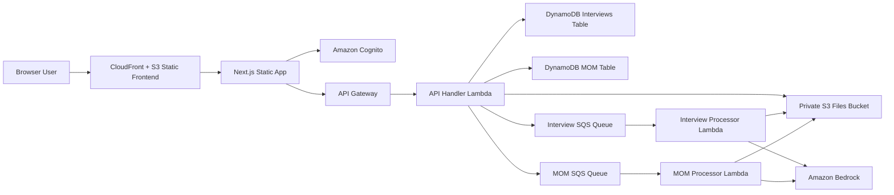

# Minfy AI Work Clarity Suite

Minfy AI is a secure workspace for interview evaluation and meeting-minutes analysis. It helps teams turn uploaded transcripts and documents into structured, downloadable reports while keeping every record scoped to the authenticated Cognito user.

## Features

### Interview Evaluator

- Create interview evaluations with candidate, role, and interview metadata.
- Upload interview transcripts, job descriptions, and optional resumes.
- Store files under user-scoped S3 prefixes.
- Run asynchronous AI evaluation through Amazon Bedrock.
- Generate structured interview results with scores, strengths, risks, evidence, and recommendations.
- Download regenerated PDF reports with safe text wrapping for long fields.
- New-user tour guidance across evaluation list, setup, upload, processing, and results pages.

### MOM Analyzer

- Create MOM analysis records for meeting transcripts.
- Upload meeting transcript files in PDF, DOCX, or TXT format.
- Run asynchronous MOM analysis through Amazon Bedrock using the configured MOM model.
- Generate concise meeting summaries, attendees, agenda items, decisions, action items, risks, and next steps.
- Download professional PDF reports with tables, colored section headers, callouts, and safe wrapping for long content.

### Security And Ownership

- Cognito authentication protects all application APIs.
- Interview and MOM records include `owner_user_id`.
- List, read, upload, analyze, download, and delete operations verify the authenticated owner.
- S3 objects are written under user-specific prefixes rather than separate buckets per user.
- User tour completion is stored per authenticated user and per tour key.

## Architecture



## Repository Structure

```text
frontend/
  src/app/                 Next.js routes
  src/components/          Layout and reusable UI components
  src/contexts/            Auth and tour context providers
  src/lib/                 API and Cognito helpers

infrastructure/
  lib/                     CDK stack
  lambdas/api-handler/     API Gateway Lambda handler
  lambdas/processor/       Interview evaluation worker
  lambdas/mom-processor/   MOM analysis worker
  lambdas/shared/          Shared AWS/PDF/report utilities
  schema/                  Shared validation schemas
```

## Local Development

### Prerequisites

- Node.js
- npm
- AWS CLI configured for the target AWS account
- AWS CDK access
- Amazon Bedrock model access for the configured inference profiles

### Frontend

```bash
cd frontend
npm install
npm run dev
```

For production build:

```bash
cd frontend
npm run build
```

### Infrastructure

```bash
cd infrastructure
npm install
npm run build
npx cdk deploy --all --require-approval never
```

The CDK stack deploys:

- S3 files bucket
- DynamoDB interview and MOM tables
- SQS queues and DLQs
- API Gateway
- Cognito user pool and client
- Lambda workers
- S3 + CloudFront frontend hosting

## Environment Notes

Most runtime environment variables are injected by CDK. The `.env.template` file documents local Lambda/SAM-style variables.

Important runtime values include:

- `TABLE_NAME`
- `MOM_TABLE_NAME`
- `BUCKET_NAME`
- `QUEUE_URL`
- `MOM_QUEUE_URL`
- `BEDROCK_SONNET_PROFILE_ARN`
- `BEDROCK_NOVA_PROFILE_ARN`
- `MOM_MODEL_ID`

The frontend uses `NEXT_PUBLIC_API_BASE_URL` in `.env.local` for API calls.

## Report Generation

PDF reports are generated server-side with `pdf-lib`.

- Interview reports are generated by `generateInterviewPdfReport`.
- MOM reports are generated by `generateMomPdfReport`.
- Report downloads regenerate PDFs from stored JSON so older completed records receive the latest layout fixes.
- Text wrapping is generic and handles long names, IDs, URLs, cloud resources, and unbroken strings.

## Tour Guide Behavior

Tours are designed for new users and show once per user per tour key.

Current interview tour keys:

- `interviews-list`
- `interviews-new-details`
- `interviews-new-upload`
- `interviews-view-setup`
- `interviews-view-processing`
- `interviews-view-results`

Completion is persisted in user preferences and mirrored locally as a fallback.

## Deployment Outputs

CDK prints the key deployment outputs after a successful deploy:

- Frontend URL
- API URL
- S3 bucket name
- DynamoDB table names
- Cognito user pool ID
- Cognito user pool client ID

## Operational Notes

- Keep `main` stable.
- Use feature branches for review and deployment changes.
- Do not remove owner checks from interview or MOM APIs.
- Do not expose the files bucket publicly.
- When report layouts change, download endpoints regenerate PDFs from stored JSON.
