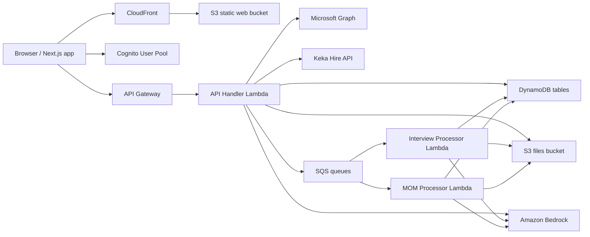

# Minfy MiMo AI Hub - Project Handoff

This document is the onboarding reference for anyone joining the Minfy MiMo AI Hub project. It explains what the application does, how the code is organized, what is deployed, which integrations exist, and what to check before making changes.

Do not place credentials, access keys, client secrets, API keys, or temporary passwords in this document.

## 1. Product Context

Minfy MiMo AI Hub is an internal AI platform for delivery, hiring, and project teams. The application currently has two main product areas:

1. Interview Evaluator
2. MOM Analyzer

The old Terraform Generator work was removed from the product because it was no longer required.

The current production focus is:

- Standard interview evaluation from manually uploaded documents.
- Connected interview intelligence using Keka and Microsoft Teams where possible.
- Meeting minutes analysis with professional PDF reports.

## 2. Current Live Environment

Primary live environment:

- Frontend: `https://d2itpe2tuxdkli.cloudfront.net`
- API Gateway: `https://1t6ztx9pma.execute-api.ap-south-1.amazonaws.com/dev/`
- AWS region: `ap-south-1`
- Environment name: `dev`
- CDK stack: `IepStack-dev`

Important: if the frontend points to a Cognito pool or API from another AWS account, users can see errors like "Cognito user pool does not exist". Always confirm the deployed frontend environment variables match the active AWS account.

## 3. Main Architecture

High-level request flow:



Main AWS resources:

- S3 web hosting bucket for the frontend build.
- CloudFront distribution for the website.
- API Gateway REST API.
- Cognito User Pool and User Pool Client.
- Lambda functions for API, interview processing, MOM processing, and supporting tasks.
- DynamoDB tables for interviews, MOM projects/reports, and interview intelligence workspaces.
- S3 bucket for uploaded files and generated reports.
- SQS queues for async processing.
- IAM roles and policies created by CDK.
- Bedrock model access through configured model IDs or inference profiles.

## 4. Repository Layout

```text
frontend/
  src/app/                     Next.js App Router pages
  src/components/              Shared UI components and shell
  src/lib/                     API client, auth, helpers, constants
  public/                      Static frontend assets

infrastructure/
  bin/                         CDK app entrypoint
  lib/                         CDK stack definition
  lambdas/
    api-handler/               Main API Lambda, Keka/Teams logic, question guide logic
    processor/                 Async standard interview evaluation worker
    mom-processor/             Async MOM analysis worker
    shared/                    Shared PDF generators and utilities
  schema/                      Zod schemas shared by Lambda code
  scripts/                     Migration, cleanup, and support scripts

docs/                          Product, UI, implementation, and handoff docs
tests/                         Test assets and event samples
outputs/                       Local/generated outputs, not product source
rollback-patches/              Patch snapshots for rollback/reference
```

## 5. Frontend Overview

The frontend is a Next.js application under `frontend/`.

Important files:

- `frontend/src/components/layout/Sidebar.tsx`
  - Left navigation.
  - Brand currently shown as "Minfy MiMo AI Hub".
  - Brand click should take the user to the home page.

- `frontend/src/components/layout/AppShell.tsx`
  - Main authenticated shell and page frame.

- `frontend/src/app/page.tsx`
  - Hub dashboard.
  - Should present the product as an AI Hub with tools, not as separate unrelated prototypes.

- `frontend/src/app/interviews/page.tsx`
  - Interview Evaluator landing/list page.
  - Entry point for both standard and connected interview workflows.

- `frontend/src/app/interviews/new/page.tsx`
  - Standard/manual interview evaluation.
  - User manually provides JD, optional resume, transcript, and can generate a recommended interview guide.

- `frontend/src/app/interviews/intelligence/page.tsx`
  - Connected Interview Intelligence list/workspaces.

- `frontend/src/app/interviews/intelligence/new/page.tsx`
  - Creates a connected interview workspace from Keka/Teams context.

- `frontend/src/app/interviews/intelligence/view/page.tsx`
  - Connected workspace details, question guide, transcript sync, AI review, report approval/download.

- `frontend/src/app/mom/page.tsx`
  - MOM Analyzer projects.

- `frontend/src/app/mom/project/page.tsx`
  - MOM project detail and meeting transcript uploads.

- `frontend/src/app/mom/view/page.tsx`
  - MOM report status/detail/download.

- `frontend/src/lib/auth.ts`
  - Cognito auth and forgot-password helpers.

- `frontend/src/lib/api.ts`
  - Authenticated API client.
  - Uses `NEXT_PUBLIC_API_BASE_URL`.

## 6. Backend Overview

The backend is CDK plus Lambda under `infrastructure/`.

Important files:

- `infrastructure/lib/infrastructure-stack.ts`
  - Creates core AWS resources.
  - Wires Lambda environment variables.
  - Defines DynamoDB tables, S3 buckets, Cognito, API Gateway, SQS, CloudFront, and outputs.

- `infrastructure/lambdas/api-handler/index.ts`
  - Main REST API handler.
  - Handles authenticated user scoping.
  - Handles interview metadata, MOM projects/reports, connected intelligence workspaces, question generation, Teams sync, Keka fetches, and report download endpoints.

- `infrastructure/lambdas/api-handler/intelligence-integrations.ts`
  - Keka and Microsoft Graph integration helpers.
  - Handles API calls, mapping, and transcript sync support.

- `infrastructure/lambdas/api-handler/minfy-careers.ts`
  - Minfy careers/JD fetch and cache logic.

- `infrastructure/lambdas/api-handler/minfy-role-question-bank.ts`
  - Curated role/question-bank logic used as the base for question recommendations.

- `infrastructure/lambdas/processor/index.ts`
  - Standard interview evaluation worker.
  - Uses Bedrock to evaluate candidate and interviewer/panel where available.
  - Generates interview PDF report.

- `infrastructure/lambdas/mom-processor/index.ts`
  - MOM transcript analysis worker.
  - Uses Bedrock and `MomResultSchema`.
  - Generates MOM PDF report.

- `infrastructure/lambdas/shared/interview-report.ts`
  - Standard interview PDF renderer.

- `infrastructure/lambdas/shared/intelligence-report.ts`
  - Connected interview intelligence PDF renderer.

- `infrastructure/lambdas/shared/mom-report.ts`
  - MOM PDF renderer.

- `infrastructure/schema/index.ts`
  - Interview evaluation Zod schemas.

- `infrastructure/schema/mom.ts`
  - MOM result Zod schema.

## 7. Data Model Summary

There are three main DynamoDB tables:

1. Interviews table
   - Standard/manual interview evaluations.
   - Stores metadata, status, owner, result, report references, and file references.

2. MOM table
   - MOM projects and meeting reports.
   - Stores project records, report records, status, analysis output, and report file references.

3. Interview Intelligence table
   - Connected interview workspaces.
   - Stores Keka job/candidate/interview context, Teams metadata, resume file references, generated guide, synced transcript, AI analysis, approval status, and report references.

All user-owned records must be scoped to the authenticated Cognito user. Do not add new list/get/delete/update endpoints that read by raw ID without owner validation.

## 8. S3 Storage Pattern

S3 stores uploaded input files and generated PDF reports. The current storage convention is user-scoped so files can be traced and safely deleted:

```text
users/{user-email-or-id}/interviews/{interview-id}/...
users/{user-email-or-id}/moms/{mom-id}/...
users/{user-email-or-id}/intelligence/{workspace-id}/...
```

Delete behavior:

- Deleting a report from the application should delete its DynamoDB metadata and related S3 objects for that record.
- Deleting a Cognito user alone does not automatically delete their S3/DynamoDB data unless explicit cleanup code is run.

## 9. Authentication And User Data Safety

Authentication is Cognito-based.

Rules for new backend work:

- Always derive the user from the Cognito authorizer claims.
- Store `owner_user_id` or equivalent owner metadata on created records.
- For every ID-based operation, verify ownership before returning, modifying, deleting, or reprocessing data.
- Never trust an ID from the frontend as proof of access.
- Never return S3 keys or signed URLs for records the caller does not own.

Forgot password:

- Implemented through Cognito forgot-password flow in the frontend/auth layer.
- If it does not appear live, verify the frontend was rebuilt and deployed with the latest code.
- If reset emails do not arrive for one user but work for others, check spam/quarantine, Cognito user status, email verification state, and SES/Cognito delivery logs.

## 10. AI Model Configuration

The application uses Amazon Bedrock.

Current preferred model:

- Claude Sonnet 5 through Bedrock where available.

Important environment variables:

- `MOM_MODEL_ID`
  - Used by MOM processor.
  - Current intended value: `global.anthropic.claude-sonnet-5`

- `BEDROCK_SONNET_5_PROFILE_ARN`
  - Used where an inference profile is required or preferred.

- `BEDROCK_SONNET_4_PROFILE_ARN`
  - Legacy/fallback option if configured.

- `ALLOW_BEDROCK_BASE_MODEL_FALLBACK`
  - Should generally remain `false` in production to avoid silent model fallback.

Before changing model IDs:

1. Confirm the model is available in the deployed AWS account and region.
2. Confirm Bedrock model access is approved.
3. Test one small API call before deploying broadly.
4. Keep prompts and Zod schemas aligned.

## 11. Interview Evaluator

The Interview Evaluator has two modes inside one tool.

### 11.1 Standard Mode

Purpose:

- Manual evaluation when Keka/Teams integrations are not being used.

User flow:

1. Create a new evaluation.
2. Select/fetch a JD or upload/paste a JD.
3. Optionally upload resume.
4. Generate recommended interview guide if needed.
5. Upload/paste transcript after the interview.
6. Run evaluation.
7. Download PDF report.

Important behavior:

- Candidate evaluation and panel/interviewer evaluation should both be included where transcript evidence supports it.
- Report should include exact transcript evidence/quotes where possible.
- Question generation should use the curated bank and role/JD/resume context, then Bedrock should rewrite into natural interview-style scenario questions.

### 11.2 Connected Intelligence Mode

Purpose:

- Reduce manual work by pulling interview context from Keka and transcript data from Microsoft Teams.

Target flow:

1. Keka provides job, candidate, resume, interview schedule, panel, and Teams meeting link.
2. System creates an interview workspace.
3. System generates a panel guide before the interview.
4. Teams meeting happens.
5. System syncs transcript after Teams has processed it.
6. AI evaluates candidate coverage and interviewer/panel quality.
7. Human reviewer approves or exports the final report.

Current known constraints:

- Keka integration depends on the exact Hire API payload shape and granted permissions.
- Some Keka fields may be missing or named differently than expected.
- Resume fetch from Keka must be verified against the actual Keka endpoint response.
- Teams transcript sync requires a valid meeting reference/link and the correct organizer/account access.
- Microsoft Teams Application Access Policy is managed in Microsoft 365, not hardcoded in this repo.

Do not hardcode specific organizer emails, candidates, roles, or job IDs in code. Access policy membership can change.

## 12. Keka Integration

Keka is used for connected interview workspace creation.

Expected data from Keka:

- Jobs / job details
- Job descriptions
- Candidates
- Candidate details
- Candidate resumes
- Interview schedules
- Interview panel members
- Teams meeting link when available
- Scorecards or notes if write-back is enabled later

Permissions requested from HR/IT:

- Job Read
- JobField Read
- CandidateDetails Read
- CandidateInterview Read
- CandidateResume Read
- CandidateScorecard Read
- CandidateNote Write, only if writing final report or notes back to Keka
- Candidate status/assessment write permissions only if the final workflow requires write-back

Keka base URL:

- Usually derived from the company Keka tenant URL.
- Example tenant URL: `https://minfy.keka.com`
- API base is not the dashboard URL directly; use the Keka Developer portal's API base pattern for the Hire API.

Implementation caution:

- Keka responses may contain HTML in job descriptions. Convert HTML to readable text before showing it or using it in prompts.
- Keka interview timestamps may be Unix epoch values. Format them before displaying.
- Do not show raw numeric schedule IDs or raw HTML to end users.

## 13. Microsoft Teams Integration

Microsoft Teams transcript sync uses Microsoft Graph.

Required Microsoft Graph application permissions generally include:

- `Calendars.Read`
- `OnlineMeetings.Read.All`
- `OnlineMeetingTranscript.Read.All`
- `OnlineMeetingRecording.Read.All` if recording access is needed
- `User.ReadBasic.All`

Admin consent must be granted.

Important Teams constraints:

- Transcript retrieval only works after the meeting ends and Teams has processed the transcript.
- The meeting organizer/account must be covered by the Teams Application Access Policy.
- The app cannot reliably scrape a transcript from a public Teams URL. It must use Graph APIs and a resolvable online meeting/transcript reference.
- If Keka does not provide a Teams link or usable meeting reference, automatic sync cannot work for that record.

Common Teams errors:

- Credentials rejected:
  - Check tenant ID, client ID, client secret value, not secret ID.
  - Check Lambda environment variables were deployed.

- Could not retrieve transcript:
  - Meeting not finished.
  - Transcript not generated or still processing.
  - Organizer not in application access policy.
  - Meeting link/reference cannot be resolved by Graph.
  - Graph endpoint response shape changed or requires another lookup path.

## 14. Question Recommendation Engine

Current intent:

- Use Minfy role/JD data and a curated question bank as the approved base.
- Use Bedrock to adapt the questions into professional, scenario-based interviewer language.
- Include resume/context questions when resume is available.
- Do not count generic introduction/resume-walkthrough questions against strict panel technical coverage.

Question quality requirements:

- Questions should sound like a real interviewer speaking to a candidate.
- Questions should not be childish or generic.
- Questions should be role-level appropriate.
- Questions should test decision-making, tradeoffs, troubleshooting, ownership, and production judgment.
- Questions should include follow-ups, what-to-evaluate guidance, strong signals, and red flags.
- Questions should be categorized, for example:
  - Opening and candidate context
  - Role scenarios and technical depth
  - Architecture and tradeoffs
  - Troubleshooting and operations
  - Collaboration and ownership

Avoid:

- Repeating the same template with only a skill name swapped.
- Asking "do you have 8-12 years experience" as a question.
- Hardcoding a role-specific filter in code.

## 15. MOM Analyzer

Purpose:

- Convert meeting transcripts into structured, professional Minutes of Meeting reports.

User flow:

1. Create a MOM project.
2. Add one or more meeting transcripts under the project.
3. Analyzer extracts summary, attendees, agenda, decisions, risks, action items, next steps, and optional next meeting details.
4. PDF report is generated and stored.
5. User downloads PDF.

Important behavior:

- MOM Analyzer uses a stable Zod schema in `infrastructure/schema/mom.ts`.
- The Bedrock prompt, schema, and PDF generator must stay aligned.
- The PDF should preserve the approved visual style while improving content categorization.
- If attendee roles are not present in the transcript, do not write "role not specified" in the table. Use a styled note explaining that roles were not identified in the transcript.

Common MOM errors:

- `AI_EMPTY_RESPONSE`
  - Bedrock returned no usable content.
  - Check model access, inference profile, prompt output tags, and CloudWatch logs.

- Schema validation failure
  - Prompt output and `MomResultSchema` are out of sync.

## 16. PDF Reports

PDF reports are generated in Lambda using shared PDF utilities.

Main requirements:

- Content must not overflow boxes.
- Section headings should not be left at the end of a page with content on the next page.
- Tables should wrap text safely.
- Reports should include enough color and hierarchy to be readable, but not look decorative or artificial.
- Interview reports should include evidence from the transcript where available.
- Intelligence reports should include both candidate and panel/interviewer scoring.
- MOM reports should be categorized and executive-readable.

When changing a report:

1. Update schema if the AI output shape changes.
2. Update prompt if the AI output shape changes.
3. Update renderer.
4. Generate a sample PDF and visually inspect it.
5. Check long text, tables, page breaks, and title spacing.

## 17. Deployment

Use the new AWS account credentials only when deploying the current environment. Do not switch between old and new account credentials.

Infrastructure deployment:

```powershell
cd "D:\Interview Agent\infrastructure"
npm install
npm run build
npx cdk deploy --all --require-approval never
```

`npm run build` is `tsc --noEmit` — a type check, not a compile. Never remove the
`--noEmit`: an emit writes `.js`/`.d.ts` shadows beside their `.ts` sources, and
esbuild resolves `.js` first, so the next deploy bundles the stale shadow and
silently ships old Lambda code. The shadows are gitignored, so `git status` will
not warn you. Guard before every deploy — this must print `0`:

```powershell
cd "D:\Interview Agent\infrastructure"
(Get-ChildItem -Recurse -Include *.js,*.d.ts,*.js.map -File `
  | Where-Object FullName -notmatch '\\(node_modules|cdk\.out)\\' `
  | Where-Object Name -ne 'jest.config.js').Count
```

Frontend deployment:

```powershell
cd "D:\Interview Agent\frontend"
npm install
npm run build
aws s3 sync out s3://<frontend-hosting-bucket> --delete --region ap-south-1
aws cloudfront create-invalidation --distribution-id <distribution-id> --paths "/*" --region ap-south-1
```

Frontend environment variables must match CDK outputs:

```text
NEXT_PUBLIC_API_BASE_URL=<api gateway dev url>
NEXT_PUBLIC_COGNITO_USER_POOL_ID=<user pool id>
NEXT_PUBLIC_COGNITO_CLIENT_ID=<user pool client id>
```

If these are wrong, the site can load visually but login/API calls will fail.

## 18. Local Development

Frontend:

```powershell
cd "D:\Interview Agent\frontend"
npm install
npm run dev
```

Infrastructure TypeScript check:

```powershell
cd "D:\Interview Agent\infrastructure"
npm install
npm run build
```

Recommended search commands:

```powershell
rg "intelligence" frontend/src infrastructure/lambdas infrastructure/schema
rg "MOM_MODEL_ID|Bedrock|Sonnet" infrastructure
rg "NEXT_PUBLIC_API_BASE_URL|COGNITO" frontend/src infrastructure
```

## 19. Debugging Checklist

When the UI does not show a recent change:

1. Confirm the local code was built.
2. Confirm the frontend `out/` folder was uploaded to the correct S3 hosting bucket.
3. Confirm CloudFront invalidation completed.
4. Test in an incognito/private browser.
5. Confirm the URL is the new account URL, not the old account URL.

When login fails:

1. Confirm frontend Cognito env variables point to the deployed user pool.
2. Confirm the user exists in the new account user pool.
3. Confirm user status in Cognito.
4. Confirm email verification/reset configuration.

When MOM analysis fails:

1. Check CloudWatch logs for `mom-processor`.
2. Confirm `MOM_MODEL_ID` and Bedrock access.
3. Confirm prompt output has `<mom_json>...</mom_json>`.
4. Confirm Zod schema matches prompt output.

When interview analysis fails:

1. Check CloudWatch logs for `processor` or `api-handler`, depending on flow.
2. Confirm transcript/JD/resume inputs were saved.
3. Confirm Bedrock profile/model access.
4. Confirm generated JSON validates against schema.

When Teams transcript sync fails:

1. Confirm Teams credentials are deployed as Lambda environment variables.
2. Confirm client secret value is correct, not secret ID.
3. Confirm the organizer is covered by Teams Application Access Policy.
4. Confirm the meeting has ended.
5. Confirm transcript is generated and processed by Teams.
6. Confirm the workspace has a usable Teams meeting link/reference.

When Keka data looks wrong:

1. Inspect the raw API response in Lambda logs.
2. Map the actual Keka field names instead of assuming names.
3. Convert HTML job descriptions to plain text.
4. Format epoch timestamps before showing them.
5. Do not hardcode role-specific fixes.

## 20. Git And Rollback Practice

The project has had rapid changes. Keep work recoverable.

Recommended workflow:

1. Create a branch before a large feature.
2. Commit after each stable milestone.
3. Run build checks before deployment.
4. Keep feature changes scoped.
5. Do not mix UI redesign, backend integration, and data migration in one unreviewed change unless necessary.

Rollback approach:

- Use the latest stable git commit if a feature breaks.
- Use `rollback-patches/` only as reference if needed.
- Do not run destructive git commands unless the rollback target is confirmed.

## 21. What Not To Do

- Do not commit `.env` or secrets.
- Do not hardcode specific users, organizer emails, candidate names, job names, or access-policy membership.
- Do not bypass Cognito owner checks.
- Do not change model IDs without validating Bedrock access.
- Do not change prompt output shape without updating Zod schema and PDF renderer.
- Do not deploy frontend against the old account by accident.
- Do not add mock labels or "waiting for mock" language to production UI.
- Do not expose raw API payloads, raw HTML, or numeric timestamps to users.

## 22. Current Known Product Direction

Near-term priorities:

1. Make Interview Evaluator feel like one product with two modes:
   - Standard/manual mode.
   - Connected Keka/Teams intelligence mode.

2. Improve connected mode UX:
   - Cleaner workspace creation.
   - Searchable/categorized roles.
   - Proper candidate/interview schedule formatting.
   - Clear transcript sync state.
   - No premature warning flashes.

3. Strengthen question generation:
   - Use curated bank as source material.
   - Let Bedrock rewrite into realistic, scenario-based interviewer language.
   - Include resume-specific questions when resume is available.
   - Categorize questions.

4. Strengthen intelligence reports:
   - Candidate score.
   - Panel/interviewer score.
   - Evidence quotes.
   - JD skill coverage.
   - Missed areas.
   - Final recommendation with human approval.

5. Keep MOM Analyzer stable:
   - Do not break the current report quality.
   - Preserve the accepted PDF style.
   - Improve only content structure and spacing when needed.

## 23. New Developer First-Day Checklist

1. Read this file.
2. Read `README.md`.
3. Read `DEPLOYMENT_HANDOFF.md`.
4. Read `docs/PRODUCT_UX_BLUEPRINT.md`.
5. Inspect `infrastructure/lib/infrastructure-stack.ts`.
6. Inspect `frontend/src/lib/api.ts` and `frontend/src/lib/auth.ts`.
7. Run frontend build.
8. Run infrastructure build.
9. Confirm the active AWS account before deploying.
10. Check the live URL only after CloudFront invalidation completes.

## 24. Final Feature Placeholder

The user plans to add one final feature after the current handoff. Before starting it:

1. Confirm whether it is UI-only or backend-affecting.
2. Create a git checkpoint.
3. Identify affected files.
4. State whether it can affect existing Interview or MOM flows.
5. Implement incrementally and verify with builds before deployment.

