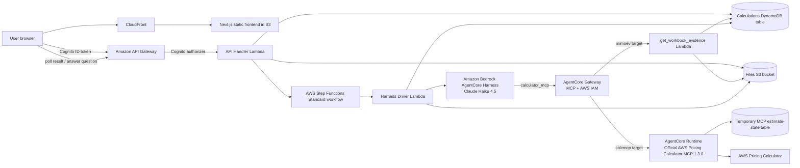
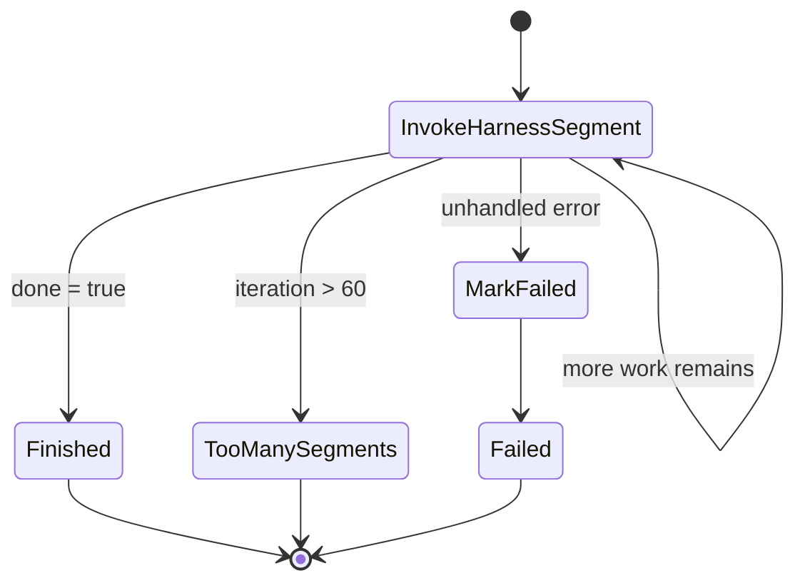
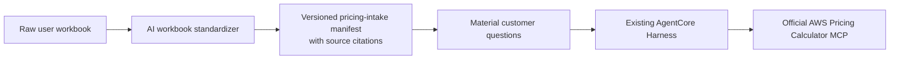

# MIMO AWS Cost Calculator — Current Technical Architecture

**Environment reviewed:** DEV (`IepStack-dev`, `ap-south-1`)  
**Review date:** 14 September 2026  
**Purpose:** Explain how the current calculator works, which AWS services it uses, how the components connect, and where the present implementation still needs improvement.

## 1. Executive overview

MIMO is the application shell around an AI-driven AWS cost-estimation workflow. A signed-in user uploads an Excel or CSV workbook, reviews the detected scope, and starts an estimate. The request then runs asynchronously through AWS Step Functions and Amazon Bedrock AgentCore.

The production agent is Claude Haiku 4.5 running in an AgentCore Harness. Claude reads the uploaded workbook through one MIMO-owned tool, `get_workbook_evidence`, and uses the official `sample-aws-pricing-calculator-mcp` package, version 1.3.0, to discover AWS services, configure line items, validate the estimate, save it, and return a real `calculator.aws` URL.

MIMO is responsible for authentication, file handling, job state, question rendering, persistence, reports, and observability. It is not intended to calculate AWS prices or decide customer workload values. The AWS Pricing Calculator MCP is the authority for Calculator fields, validation, supported configurations, and saved estimates. Claude is responsible for interpreting the workbook and deciding when a material customer fact is missing.

## 2. Architecture at a glance



## 3. User journey

### 3.1 Create and upload

1. The user creates an estimate and optionally associates it with a calculator project.
2. The browser requests a presigned upload URL from `POST /calculator/upload-url`.
3. The browser uploads the workbook directly to Amazon S3. This avoids sending a large binary file through API Gateway and Lambda.
4. The application accepts `.xlsx` and `.csv`. The older `.xls` format is rejected with an instruction to resave it as `.xlsx`.

### 3.2 Analyze and review

1. `POST /calculator/analyze` reads the workbook and creates a review representation for the frontend.
2. The parser recognizes flat inventories, repeated-section BOMs, transposed year/scenario matrices, and Calculator exports by layout.
3. The API writes a source-linked **MIMO Pricing Intake v2** workbook with Instructions, Inputs Needed, Safe Assumptions, Source Context, Source Lineage, and one pricing sheet per detected year/scenario.
4. Material missing technical values are grouped on Inputs Needed and highlighted in yellow on the pricing sheets. The customer fills the workbook in bulk and uploads it again; MIMO does not turn hundreds of missing cells into web questions.
5. Large parsed resource collections are stored in S3. DynamoDB keeps a bounded preview so an estimate record stays below DynamoDB item-size limits.
6. Once the prepared workbook is ready, the user confirms the run.

This pre-run representation helps the user inspect the upload, but it is not supposed to determine AWS pricing. Older objects such as `WorkbookSemanticModel`, `ScenarioRequirements`, MIMO mappings, and MIMO defaults remain in the codebase for compatibility and rollback. The AgentCore prompt explicitly tells Claude not to treat them as customer answers or pricing authority.

### 3.3 Build the estimate

1. `POST /calculator/plans/{id}/run` persists the full workbook evidence and starts a Standard Step Functions execution.
2. The API immediately returns an asynchronous status instead of holding the browser connection open.
3. The frontend opens the estimate page and polls `GET /calculator/{id}/result` every 1.2 seconds.
4. Step Functions invokes the Harness Driver Lambda for one bounded AgentCore segment.
5. The Harness runs Claude's model-and-tool loop. MIMO does not implement a second Claude loop in Lambda or Step Functions.
6. Claude pages through `get_workbook_evidence`, discovers the required AWS services and fields through the official MCP, and builds the saved estimate.
7. The driver stores progress, traces, questions, and the terminal result in DynamoDB and S3.

### 3.4 Ask for missing customer input

The AgentCore Harness exposes `request_user_input` as an inline function. In the prepared-workbook production flow it is restricted to two decisions: the MCP-supported commercial pricing strategy and the selection of consolidated or separate scenario links. Region, sizing, schedules, storage, availability, and other material technical gaps are completed in the prepared workbook before the costly AgentCore run begins.

When Claude calls it:

1. The Harness returns a tool-use event to the Harness Driver.
2. The driver persists the tool-use ID, structured question, and AgentCore runtime session ID.
3. The calculation status becomes `WAITING_FOR_INPUT`.
4. The frontend displays the active question with one of these controls:
   - a single choice;
   - multiple choices;
   - a number;
   - yes/no;
   - free text;
   - an optional **Other / give your own input** field.
5. The answer is posted to `POST /calculator/{id}/answer`.
6. The API starts another Step Functions execution using the same AgentCore `runtimeSessionId`.
7. The driver replays the original assistant tool-use message and supplies the customer's answer as the matching tool result. Claude then continues the same conversation rather than restarting workbook analysis.

The prompt asks each applicable category once at most and one category per pause. A commercial option is a complete package containing plan, term, and payment where applicable, which avoids additional term/payment interruptions.

### 3.5 Complete, review, or fail

The main terminal states are:

| Status | Meaning |
|---|---|
| `COMPLETED` | A saved Calculator estimate exists and the required validation and evidence checks passed. |
| `WAITING_FOR_INPUT` | Claude needs a material customer decision before continuing. |
| `NEEDS_REVIEW` | A Calculator estimate exists, but one or more requirements or source rows could not be verified. |
| `PARTIAL` | Only part of the requested scope was successfully produced. |
| `FAILED` | The workflow could not produce a usable saved estimate. |

The final screen can provide:

- one or more real AWS Pricing Calculator links;
- recurring monthly, upfront, and twelve-month values when returned and verified;
- configured services and scenario information;
- assumptions, warnings, exclusions, and unsupported items;
- PDF, Excel, and Word downloads through presigned S3 URLs.

## 4. AWS service responsibilities

| Service or component | Responsibility |
|---|---|
| Amazon CloudFront | Serves the deployed web application globally. |
| Amazon S3 frontend bucket | Stores the static Next.js frontend build. |
| Amazon Cognito | Authenticates users and supplies the ID token used by the API. |
| Amazon API Gateway | Exposes authenticated calculator REST endpoints. |
| API Handler Lambda | Enforces ownership, creates upload URLs, parses workbooks, manages records, starts and resumes jobs, returns results, and creates download URLs. |
| Amazon S3 files bucket | Stores source workbooks, lossless workbook evidence, large parsed payloads, execution traces, final JSON, and generated documents. |
| Calculations DynamoDB table | Stores each estimate's owner, lifecycle state, progress, questions, answers, AgentCore session ID, result summary, and project association. |
| MCP estimates DynamoDB table | Temporary state used by the upstream MCP across `create_estimate`, `add_service`, validation, and export calls. Items expire after 24 hours. |
| AWS Step Functions Standard | Provides the durable asynchronous shell for starting, continuing, completing, and failing a calculation. It contains no pricing rules. |
| Harness Driver Lambda | Invokes one bounded Harness segment, consumes the event stream, persists progress and traces, handles pauses, and validates the final response contract. |
| Amazon Bedrock AgentCore Harness | Runs Claude's managed reasoning and tool-use loop. |
| Amazon Bedrock AgentCore Gateway | Authenticates and routes MCP calls to the official Calculator Runtime and the workbook-evidence Lambda. |
| Amazon Bedrock AgentCore Runtime | Runs the containerized official AWS Pricing Calculator MCP server. |
| `get_workbook_evidence` Lambda | Gives Claude owner-scoped, pageable access to the complete uploaded workbook evidence. |
| Calculator browser validator | Opens the saved Calculator result when required and checks that the link and displayed result are usable. |
| Amazon CloudWatch | Holds Lambda, Gateway, Runtime, and Step Functions logs and operational traces. |

## 5. Agent and MCP contract

### 5.1 Production model

The AgentCore Harness uses:

```text
global.anthropic.claude-haiku-4-5-20251001-v1:0
```

The current Harness limits are:

| Setting | Value |
|---|---:|
| Maximum agent iterations per Harness invocation | 12 |
| Maximum model output tokens | 4,096 |
| Harness invocation segment timeout | 420 seconds |
| Managed AgentCore session maximum lifetime | 8 hours |

### 5.2 Tools available to Claude

MIMO allows the complete upstream Calculator MCP 1.3.0 surface:

- `get_server_info`
- `search_services`
- `get_service_fields`
- `create_estimate`
- `add_service`
- `validate_estimate`
- `build_estimate`
- `export_estimate`
- `import_estimate`

MIMO adds only one domain evidence tool:

- `get_workbook_evidence`

The Harness also has one application interaction function:

- `request_user_input`

MIMO does not copy or override the official MCP tool descriptions. The Gateway discovers the MCP's tools from the Runtime through MCP `tools/list`, which avoids schema drift when the upstream package changes.

### 5.3 Required agent behavior

The production system prompt requires Claude to:

- read all relevant workbook evidence, following pagination until `moreAvailable=false`;
- use workbook content and customer answers as the source of workload intent;
- stop before pricing if the prepared workbook still reports material technical gaps;
- ask at runtime only for commercial pricing strategy and scenario-link selection;
- call `get_service_fields` before configuring a service;
- use the MCP's `minimalConfig` and supported values;
- use `build_estimate` for ordinary multi-service estimates;
- use `create_estimate` plus batched `add_service` for large estimates;
- validate, export, and import the saved estimate before completion;
- return real `calculator.aws` URLs;
- never calculate AWS prices itself;
- account for every cost-relevant workbook row as consumed, excluded, unsupported, or unresolved.

## 6. Workbook evidence design

The workbook-evidence layer exists to prevent large or unusual spreadsheets from being silently truncated.

1. The uploaded workbook is converted into a lossless workbook intermediate representation.
2. Its recognized workload rows are normalized into Pricing Intake v2 without using a second Bedrock call. Layout recipes are also stated in the main Harness prompt so Claude reads the result consistently.
3. Evidence is classified so the system can distinguish likely billable rows, instructions, context, and layout-only rows.
4. Evidence is split into byte-bounded, per-sheet chunks and written to S3.
5. An index records the file hash, sheets, chunk IDs, row counts, and cost-relevant accounting.
6. Claude retrieves chunks through `get_workbook_evidence` using filters such as sheet, row range, environment, fiscal period, or cost-relevant rows only.
7. Oversized responses provide `nextChunkId` and `nextRowsFrom`, so the agent can continue at the exact unread point.

The evidence Lambda first reads the calculation record from DynamoDB, verifies ownership, and derives the permitted S3 prefix. A caller cannot provide an arbitrary S3 key to read another user's file.

## 7. API surface

All calculator endpoints are protected by the API Gateway Cognito authorizer.

| Endpoint | Purpose |
|---|---|
| `GET /calculator` | List the signed-in user's estimates. |
| `POST /calculator` | Create an estimate request through the compatibility entry point. |
| `GET /calculator/review-catalog` | Return review options used by the pre-run UI. |
| `POST /calculator/upload-url` | Create a presigned S3 upload URL. |
| `POST /calculator/analyze` | Parse the workbook and create the review plan. |
| `GET /calculator/plans/{id}` | Read the review plan. |
| `POST /calculator/plans/{id}/proposals` | Apply review proposals. |
| `POST /calculator/plans/{id}/revisions` | Create a revised plan. |
| `POST /calculator/plans/{id}/confirm` | Confirm the plan. |
| `POST /calculator/plans/{id}/run` | Start the asynchronous AgentCore calculation. |
| `GET /calculator/runs/{id}` | Read run state. |
| `GET /calculator/{id}` | Read the estimate record. |
| `GET /calculator/{id}/result` | Lightweight polling endpoint for state, questions, and result. |
| `POST /calculator/{id}/answer` | Persist an answer and resume the same AgentCore session. |
| `POST /calculator/{id}/revise` | Start an authorized revision. |
| `GET /calculator/{id}/report` | Get a presigned PDF download URL. |
| `GET /calculator/{id}/workbook` | Get a presigned Excel download URL. |
| `GET /calculator/{id}/document` | Get a presigned Word download URL. |
| `DELETE /calculator/{id}` | Delete the record and its calculator artifacts. |
| `GET/POST /calculator-projects` | List or create calculator projects. |
| `GET/DELETE /calculator-projects/{id}` | Read or delete a calculator project. |
| `GET /admin/calculator` | Organization-level calculator view for authorized admins. |

## 8. Execution and retry behavior

The Step Functions workflow deliberately stays small:



Transient Lambda and AgentCore service failures are retried up to three times with a 20-second initial delay and exponential backoff. A state-machine execution can run for up to 12 hours. Each Harness call is bounded to 420 seconds; if the managed session still has work, the state machine invokes another segment using the same session ID.

The 60-segment ceiling is a final runaway guard. It is much larger than a normal calculation and should be reduced after production timing data establishes a safe upper bound.

## 9. Security and data isolation

- Every API method uses a Cognito authorizer.
- Estimate records carry an owner user ID, and read/write routes load records through that owner context.
- Uploaded files and artifacts use owner-scoped S3 paths such as `users/{userId}/calculator/{calculationId}/...`.
- The files bucket blocks all public access and uses S3-managed encryption.
- The calculations table uses point-in-time recovery and on-demand billing.
- The AgentCore Gateway uses `AWS_IAM`; calls to the Runtime are SigV4 signed.
- The Gateway execution role can invoke only the calculator AgentCore Runtime.
- The Harness role can invoke the selected Bedrock model and Gateway, but it has no direct S3 or DynamoDB access.
- Workbook access is mediated by `get_workbook_evidence`, which checks the calculation owner before reading S3.
- AgentCore managed memory is disabled. Continuation uses the calculation's runtime session, while durable customer data remains in MIMO-controlled S3 and DynamoDB.

## 10. Cost and runaway protections currently deployed

The following live Lambda concurrency settings were verified on 10 September 2026:

| Function | Reserved concurrency | Meaning |
|---|---:|---|
| Production Harness Driver | 1 | Serializes production calculator work and limits simultaneous Bedrock activity. |
| Legacy AgentCore agent orchestrator | 0 | Disabled. It cannot invoke Bedrock. |
| Legacy calculator orchestrator | 0 | Disabled. It cannot invoke Bedrock. |

The production model was changed from Claude Sonnet 4.6 to Claude Haiku 4.5 after a high-cost run pattern was identified. The Harness also has the 12-iteration and 4,096-output-token limits described above.

Concurrency `1` protects spend but also means calculator jobs are processed serially. Additional jobs can wait or be throttled until the active driver invocation releases capacity. Increasing concurrency should be done only after per-run token, tool-call, and elapsed-time controls are proven with representative workbooks.

## 11. Result validation and accounting

The driver does more than accept a final sentence from the model:

1. It parses the required terminal JSON response.
2. It verifies that returned URLs are AWS Pricing Calculator URLs.
3. The prompt requires `validate_estimate`, `export_estimate`, and final `import_estimate` read-back.
4. It compares workbook cost-relevant row IDs with the agent's `evidenceConsumed`, `evidenceExcluded`, `evidenceUnsupported`, and `evidenceUnresolved` arrays.
5. If evidence coverage does not reconcile, the calculation is marked `NEEDS_REVIEW` rather than presented as trusted completion.
6. Execution traces are written to owner-scoped S3 paths for diagnosis.

This accounting is a guardrail. A real Calculator URL alone does not prove that every source resource was included correctly.

## 12. Current review findings and limitations

### 12.1 Claude does not always use the structured pause function

In a recent large-workbook DEV run, Claude described questions in ordinary text instead of calling `request_user_input`. The UI can only provide a durable mid-run form when the inline function is called. The backend includes repair behavior, but the model can still bypass the intended pause contract.

**Impact:** A run may proceed with too few questions or reach `NEEDS_REVIEW` after constructing an estimate with unsupported assumptions.

### 12.2 Large workbooks create excessive model context

The same reviewed run read five workbook chunks and sent approximately 174,000 input tokens in one model stage. It then resumed with an incomplete recollection of detailed rows and aggregated many source machines into a small number of Calculator line items.

**Impact:** Higher latency and Bedrock cost, plus a greater chance of omitted or merged resources.

### 12.3 Evidence reconciliation correctly exposed incomplete coverage

The reviewed run contained 398 cost-relevant rows, but the agent reported none as consumed and left all 398 unresolved. The saved URL existed, but the application marked the result `NEEDS_REVIEW`.

**Impact:** The displayed estimate must not be treated as client-ready merely because the Calculator link opens.

### 12.4 Current monthly presentation can be misleading with upfront charges

AWS Calculator distinguishes recurring monthly charges, upfront commitment payments, and the total over the first twelve months. The current headline UI presents `monthlyTotal` and displays `monthly × 12`. For a commitment with a large upfront payment, this is not the same as the Calculator's first-year total.

**Required presentation:** Show recurring monthly, upfront, first-year total, and effective first-year monthly equivalent as separate labelled values. Do not derive the first-year total as monthly times twelve when an upfront amount exists.

### 12.5 The review layer remains visible although it is no longer authoritative

The application still parses the workbook into a review plan before AgentCore starts. This can make the workflow appear as if MIMO's canonical plan drives pricing. The production agent prompt says the opposite: raw workbook evidence and user answers drive intent, and the MCP drives Calculator configuration.

**Impact:** Client and user expectations can differ from the actual pricing path. The review screen should be reframed as upload inspection, or replaced by the proposed standardization stage after that stage is implemented and validated.

### 12.6 The proposed AI workbook standardizer is not in production

A draft system prompt exists for a future workbook-conversion step, but it is not connected to the deployed AgentCore path. The proposed design would convert arbitrary workbooks into a cached, standard pricing-intake manifest while preserving source citations. It must keep environment classification separate from operating schedules: `Production` must not automatically mean 24×7, and `Non-production` must not automatically mean 8×5.

Until that component is implemented and tested through the live AgentCore → Gateway → Runtime path, the current agent reads the uploaded workbook evidence directly.

## 13. Recommended target evolution

The safest improvement is to keep the current official MCP pricing path and add one bounded AI standardization step before it:



The standardizer should:

- preserve every source row and cell citation;
- normalize services, quantities, units, periods, environments, and scenarios without pricing them;
- mark uncertain or missing material values explicitly;
- derive candidate questions, while leaving the final contextual question decision to Claude;
- cache output by workbook hash, prompt version, and answer revision;
- never silently infer prod/non-prod schedules, availability, commercial plans, storage, retention, or traffic;
- feed the same `get_workbook_evidence` contract or an explicitly versioned evidence view;
- avoid adding another pricing engine or hardcoded AWS service-decision layer.

This would reduce repeated reading of a very large workbook while preserving the official MCP as the only Calculator authority.

## 14. Live DEV inventory

| Resource | Live value |
|---|---|
| CloudFormation stack | `IepStack-dev` |
| Region | `ap-south-1` |
| Frontend | `https://d2itpe2tuxdkli.cloudfront.net` |
| API | `https://1t6ztx9pma.execute-api.ap-south-1.amazonaws.com/dev/` |
| Files bucket | `iep-dev-files-996122083346-ap-south-1` |
| Calculations table | `iep-dev-calculations-996122083346-ap-south-1` |
| Temporary MCP state table | `iep-dev-calculator-estimates-996122083346-ap-south-1` |
| Step Functions state machine | `arn:aws:states:ap-south-1:996122083346:stateMachine:iep-dev-calculator-agentcore-exec-996122083346-ap-south-1` |
| AgentCore Harness | `arn:aws:bedrock-agentcore:ap-south-1:996122083346:harness/mimoCalc_dev-dAmgUcz1zg` |
| AgentCore Gateway | `arn:aws:bedrock-agentcore:ap-south-1:996122083346:gateway/iep-dev-calculator-996122083346-ap-south-1-30f1pfwnsb` |
| AgentCore Runtime | `arn:aws:bedrock-agentcore:ap-south-1:996122083346:runtime/mimoCalcMcp_dev-G46E17C4q8` |

## 15. Source-code map

| Area | Repository location |
|---|---|
| New-estimate user flow | `frontend/src/app/calculator/new/page.tsx` |
| Estimate status, questions, results, and downloads | `frontend/src/app/calculator/view/page.tsx` |
| Frontend API client | `frontend/src/lib/calculatorApi.ts` |
| Calculator REST routes | `infrastructure/lambdas/api-handler/calculator-routes.ts` |
| Workbook parser | `infrastructure/lambdas/api-handler/calculator-workbook.ts` |
| Lossless evidence builder | `infrastructure/lambdas/shared/workbook-evidence.ts` |
| Workbook evidence tool | `infrastructure/lambdas/calculator-evidence-tool/` |
| Harness stream driver and final validation | `infrastructure/lambdas/calculator-harness-driver/index.ts` |
| Harness provisioning and `request_user_input` schema | `infrastructure/lambdas/calculator-harness-provisioner/index.ts` |
| AgentCore Runtime, Gateway, Harness, and Step Functions CDK | `infrastructure/lib/calculator-agentcore.ts` |
| Production agent instructions | `infrastructure/prompts/calculator-agent-system.txt` |
| Official MCP container wrapper | `infrastructure/lambdas/calculator-mcp-sidecar-agentcore/` |
| Main infrastructure and API definitions | `infrastructure/lib/infrastructure-stack.ts` |

## 16. Client interpretation

The current implementation has the correct core separation of responsibilities: MIMO owns the application and evidence, Claude interprets customer intent, and the official AWS Pricing Calculator MCP owns Calculator configuration and saved estimates. The asynchronous and resumable AgentCore design is appropriate for work that exceeds API Gateway's synchronous timeout.

The remaining reliability issue is not basic connectivity. The live components connect and can produce real Calculator URLs. The main issue is controlling how Claude processes large, inconsistent workbooks: it must preserve row-level coverage, call the structured clarification function whenever a material fact is missing, and maintain those details after session continuation. The proposed evidence-standardization stage can address context size and consistency, provided it remains an evidence transformation and does not become another pricing engine.
